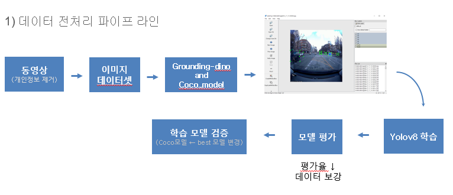
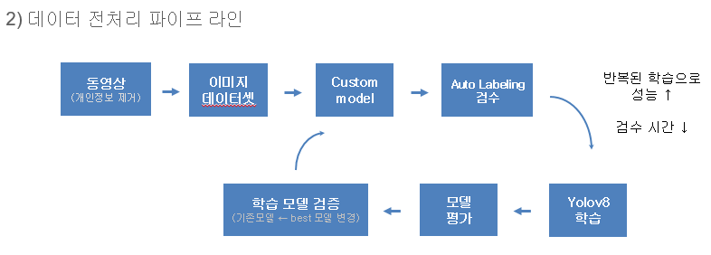

# 블랙박스 기반 위험객체 알림이
---
- 프로젝트 목적

골목길 주행 중 예상치 못한 객체들이 등장해서 깜짝 놀란 경험들이 있을텐데
운전자에게 워닝존에 객체가 들어오면 사각지대의 인식을 높이기 위해 선정

- 프로젝트 목표

1. 데이터 수집 이후 데이터 라벨링 자동화 파이프라인 구축
2. Yolo 학습 후 워닝존 위험 객체 알림 알고리즘
3. gTTS로 음성파일 생성 및 재생

- 프로젝트 개발기간

23.12.27 ~ 24.02.15

- 데이터 라벨링 자동화 파이프라인

테스트 한 모델
    - Grounding-Sam 
     
        결과 : Segmentation + Bounding_box   
    - Grounding-Dino 
     
        결과 : Bounding_box  
    - Custom model(초기는 yolov8n model) 
     
        결과 : Bounding_box  

- 초기 : 

- 최종

- 참고 사이트

Grounding-Sam : <https://github.com/IDEA-Research/GroundingDINO>
Grounding-Dino : <https://github.com/IDEA-Research/Grounded-Segment-Anything>
Custom model : <https://docs.ultralytics.com/ko>