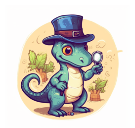
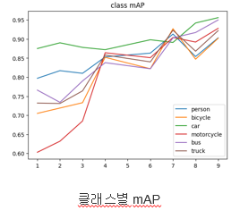

# 블랙박스 기반 위험객체 알림이
  

### 워닝존 탐지 데모영상
---
 
간단 설명
1. 중간 워닝존에 객체가 들어오면 녹색 박스로 변경
2. 워닝존에 왼쪽에 있는지 오른쪽에 있는지 판별
3. 화면 중앙 부분에 txt로 안내 및 ex)오른쪽 사람 tts 파일 재생 
파일 미존재시 비프음으로 재생 후 gTTS로 파일 생성 

### 프로젝트 목적
---
골목길 주행 중 예상치 못한 객체들이 등장해서 깜짝 놀란 경험들이 있을텐데
운전자에게 워닝존에 객체가 들어오면 사각지대의 인식을 높이기 위해 선정

### 프로젝트 목표
---

1. 데이터 수집 이후 데이터 라벨링 자동화 파이프라인 구축
2. Yolo 학습 후 워닝존 위험 객체 알림 알고리즘
3. gTTS로 음성파일 생성 및 재생

### 프로젝트 개발기간
---

- 23.12.27 ~ 24.02.15

### 데이터 라벨링 자동화 파이프라인
---

#### 테스트 한 모델 
- Grounding-Sam 
 
    결과 : Segmentation + Bounding_box   
- Grounding-Dino 
 
    결과 : Bounding_box  
- Custom model(초기는 yolov8n model) 
 
    결과 : Bounding_box  

- 초기 : 

- 최종

### Auto Labeling 결과
---
 
Grounding-Dino : box를 잘 잡는 특징을 가지고 있다. 
Yolov8n : class type를 잘 잡는 특징을 가지고 있다. 
Custom_model : Grounding-Dino, Yolov8 모델의 장점을 둘다 가지고 있다.

### Yolov8 Train & Data EDA
---
- Data EDA(학습시 데이터 버전)
 
 
- Train Result(학습 결과)
mAP
 

class_mAP
 

### Model 검증 알고리즘
---
 
알고리즘 순서
1. 학습 시킨 모델 test폴더 이미지 predict 진행. 
2. 정답이 있는 test폴더 label파일, predict 진행한 label txt파일을 비교
3. 비교를 할때 위 이미지처럼 오차율을 지정하면 사용자가 원하는 오차율 만큼 정확도를 지정할 수 있음
4. 동일하면 pass, 다르면 human_check폴더에 이미지랑 txt파일 copy
 

### 워닝존 알고리즘
---
 
알고리즘 순서
1. yolov8 predict 진행해서 탐지된 정보 가져오기 
2. 워닝존 등변사다리꼴에 객체가 들어오는지 파악 
3. 워닝존에 객체가 왼쪽에 있는지 오른쪽에 있는지 파악 
4. 장비에 음성파일이 있으면 해당 파일 재생 없으면 비프음 재생 후 gTTS 생성 및 화면에 텍스트문으로 알림.

### 참고 사이트
---
Grounding-Sam : <https://github.com/IDEA-Research/GroundingDINO> 
Grounding-Dino : <https://github.com/IDEA-Research/Grounded-Segment-Anything> 
Custom model : <https://docs.ultralytics.com/ko>